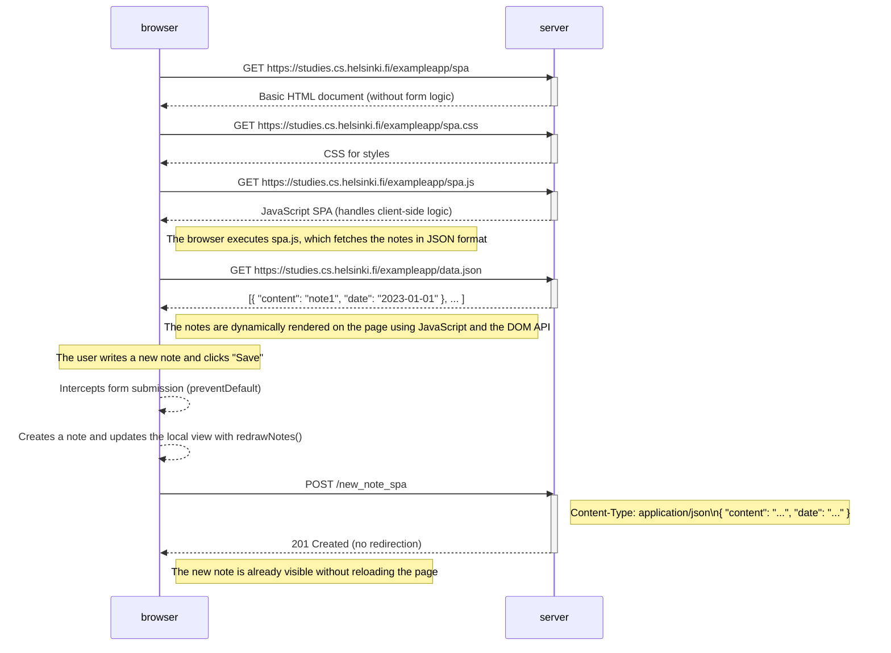

```mermaid

sequenceDiagram
    participant browser
    participant server

    browser->>server: GET https://studies.cs.helsinki.fi/exampleapp/spa
    activate server
    server-->>browser: Basic HTML document (without form logic)
    deactivate server

    browser->>server: GET https://studies.cs.helsinki.fi/exampleapp/spa.css
    activate server
    server-->>browser: CSS for styles
    deactivate server

    browser->>server: GET https://studies.cs.helsinki.fi/exampleapp/spa.js
    activate server
    server-->>browser: JavaScript SPA (handles client-side logic)
    deactivate server

    Note right of browser: The browser executes spa.js, which fetches the notes in JSON format

    browser->>server: GET https://studies.cs.helsinki.fi/exampleapp/data.json
    activate server
    server-->>browser: [{ "content": "note1", "date": "2023-01-01" }, ... ]
    deactivate server

    Note right of browser: The notes are dynamically rendered on the page using JavaScript and the DOM API

    Note over browser: The user writes a new note and clicks "Save"

    browser-->>browser: Intercepts form submission (preventDefault)
    browser-->>browser: Creates a note and updates the local view with redrawNotes()

    browser->>server: POST /new_note_spa
    activate server
    Note right of server: Content-Type: application/json\n{ "content": "...", "date": "..." }
    server-->>browser: 201 Created (no redirection)
    deactivate server

    Note right of browser: The new note is already visible without reloading the page

```