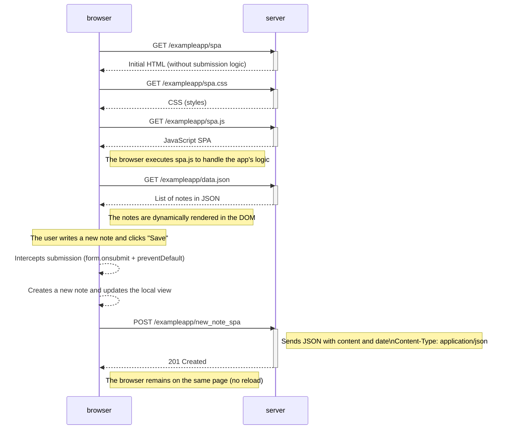

# Sequence Diagram: Loading the SPA Version of the Notes Application

```mermaid
sequenceDiagram
    participant browser
    participant server

    browser->>server: GET /exampleapp/spa
    activate server
    server-->>browser: Initial HTML (without submission logic)
    deactivate server

    browser->>server: GET /exampleapp/spa.css
    activate server
    server-->>browser: CSS (styles)
    deactivate server

    browser->>server: GET /exampleapp/spa.js
    activate server
    server-->>browser: JavaScript SPA
    deactivate server

    Note right of browser: The browser executes spa.js to handle the app's logic

    browser->>server: GET /exampleapp/data.json
    activate server
    server-->>browser: List of notes in JSON
    deactivate server

    Note right of browser: The notes are dynamically rendered in the DOM

    Note over browser: The user writes a new note and clicks "Save"

    browser-->>browser: Intercepts submission (form.onsubmit + preventDefault)
    browser-->>browser: Creates a new note and updates the local view

    browser->>server: POST /exampleapp/new_note_spa
    activate server
    Note right of server: Sends JSON with content and date\nContent-Type: application/json
    server-->>browser: 201 Created
    deactivate server

    Note right of browser: The browser remains on the same page (no reload)
```
